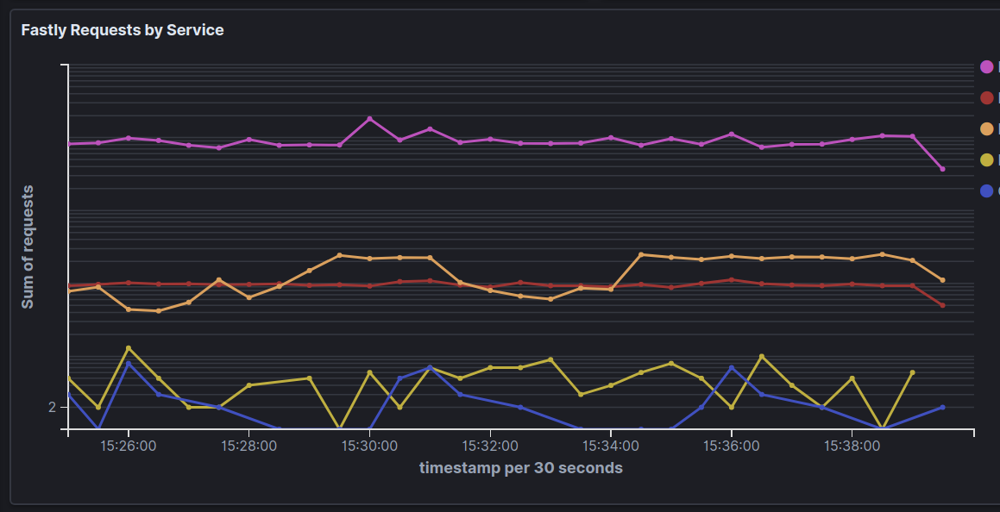

# [beefheart](http://www.grubstreet.com/2013/02/guy-fieri-guys-american-kitchen-fake-website.html)

> a natural black angus beef heart slow-cooked in a fiery sriracha honey wasabi BBQ sauce and set on a rotating lazy Susan.

Beefheart is a tool that monitors Fastly real-time analytics data and indexes it into Elasticsearch.



## quickstart

Prerequisites:
- Build
  - [stack](https://docs.haskellstack.org/en/stable/README/)
- Run or Demo
  - Fastly API key available in environment variable `FASTLY_KEY`

The following command will look for your Fastly API key in the environment variable `FASTLY_KEY` and, by default, send metrics documents to a local Elasticsearch listener at `http://localhost:9200`.

```console
$ make run
```

Testing (Docker is required)

```console
$ make test
```

See available command shortcuts to build, run a demo, and so on.

```console
$ make help
```

Beefheart comes with a `Makefile` target to quickly demonstrate its features if a) you have a Fastly account and b) your API key that can read realtime metrics is available in your shell environment under the name `FASTLY_KEY`.
With the key exported to your environment, run the demo target in a shell:

```console
$ make demo
```

And open http://localhost:5601 to begin creating dashboards from your Fastly metrics.
Use `Ctrl-C` to stop the demo, which will cleanup any Docker containers.

## Why?

Fastly provides a [real-time analytics API](https://developer.fastly.com/reference/api/metrics-stats/realtime/) that exposes a variety of metrics across services for a given account that include useful insights like transmitted bytes, number of hits, and number of requests.
While the default stats dashboard provided in the Fastly management portal is useful, extracting and storing these metrics can provide another level of utility, such as for use cases like monitoring and custom dashboards.
Beefheart extracts all (as of the time of this writing) available metrics from this API and stores them in Elasticsearch which permits you to drill down into Fastly service performance deeply.
For example, you might want to create a Kibana dashboard that highlights services pushing the most traffic, or visualize what the cache hit to cache miss ratio looks like.

## Implementation

As part of Elastic's [Space, Time](https://www.elastic.co/about/our-source-code) engineering principles, Beefheart was written in Haskell as a learning opportunity.
The core operations of a tool like this are not excessively esoteric (that is, consuming metrics from a JSON API, transforming them, and sending them along to another REST API), which provided a good neutral ground to explore principles of Haskell software development.

Note that significant effort has been taken to document the code extensively and use techniques and patterns that are friendly to newcomers.
Although the code comments and documentation should help lead a novice through the program's logic, the bulk of this project was written by a newcomer to Haskell, so contributions are welcome!

Beefheart provides useful real-world Haskell examples for:
- [Software transactional memory (STM)](https://en.wikipedia.org/wiki/Software_transactional_memory)
- Concurrent programming through the use of [async](https://hackage.haskell.org/package/async)
- HTTP request and response via [req](https://hackage.haskell.org/package/req) and JSON serialization via [aeson](https://hackage.haskell.org/package/aeson)
- Monitoring threadsafe values via [ekg](https://hackage.haskell.org/package/ekg)

## Maintenance

This project is provided as a utility to the Elastic community and is not an officially supported product.
Responsiveness to contributions, bugfixes, and features will be collaboratively supported on a best-effort basis.

### Licensing

This project is licensed under the Apache 2 open source license.

## FAQ

### Why not use Bloodhound instead of req?

Elasticsearch communication is done over plain HTTP libraries instead of [Bloodhound](https://hackage.haskell.org/package/bloodhound) because there are a few missing pieces like ILM support from the library.
Adding support for missing features to Bloodhound and using it in Beefheart would be great!

### Why is this project named "Beefheart"?

The Stack Infrastructure team at Elastic has a tradition of naming some projects after our favorite celebrities.
[Guy Fieri](https://en.wikipedia.org/wiki/Guy_Fieri) is one of our honored team mascots, and the name for this project was picked from a [satirical restaurant menu](http://www.grubstreet.com/2013/02/guy-fieri-guys-american-kitchen-fake-website.html). 
